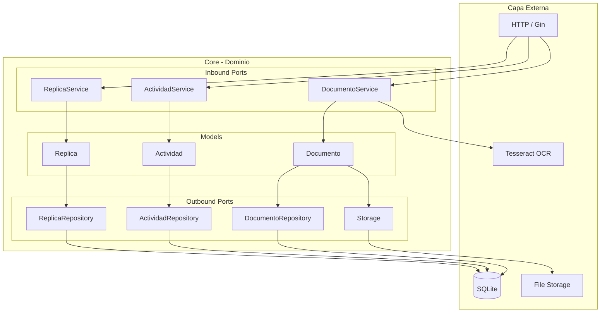

# Arsenal App

App de gestión de réplicas airsoft - Inventario, mantenimiento, documentación DIAN y registro de uso.

**Arquitectura:** Hexagonal (Ports & Adapters)  
**Stack:** Go 1.26+ + SQLite + Gin + HTMX + Tailwind CSS
**Deploy:** Docker + Docker Compose  

## Arquitectura Hexagonal



## Desarrollo

- **Rama principal:** `development`
- **Plan de tareas:** [docs/TASKS.md](docs/TASKS.md)
- **Plan completo:** [docs/PLAN.md](docs/PLAN.md)
- **Análisis de seguridad:** [docs/SECURITY.md](docs/SECURITY.md)

## Quick Start

```bash
# Desarrollo local
make dev

# Docker
make docker-up

# Tests
make test
```

## Estado

- ✅ **Fase 1:** Foundation
- ✅ **Fase 2:** Core Ops + Seguridad
- ✅ **Fase 3:** Gestión de Documentos
- ✅ **Fase 4:** Frontend Web
- ✅ **Fase 5:** Mantenimiento + DIAN
- 🚧 **Fase 6:** Auth / Seguridad API (pendiente)

### Fases completadas
- [x] Foundation: Hexagonal, CRUD, Docker, Tests
- [x] Core Ops: 11 fixes seguridad, graceful shutdown, health checks
- [x] Documentos: Multipart upload, OCR Tesseract para imágenes, búsqueda full-text
- [x] Frontend: HTMX + Tailwind, dashboard, tema claro/oscuro DCS, PWA básica
- [x] Mantenimiento + DIAN: tareas programadas, próximos mantenimientos, búsqueda por serial

### Pendiente
- [ ] JWT Authentication
- [ ] Rate limiting
- [ ] Audit logging
- [ ] **Análisis de seguridad v1** — revisión post-Fase 5, antes de implementar auth
- [ ] Backup JSON / Export CSV
- [ ] **Análisis de seguridad v2 (final)** — revisión completa post-MVP, antes de release público
- [ ] CI/CD GitHub Actions

---

*Repositorio privado - Digital Consultancy Solutions*
