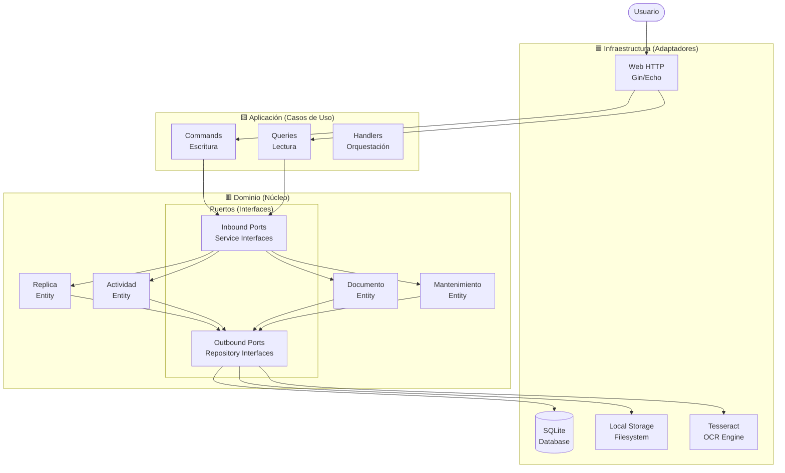
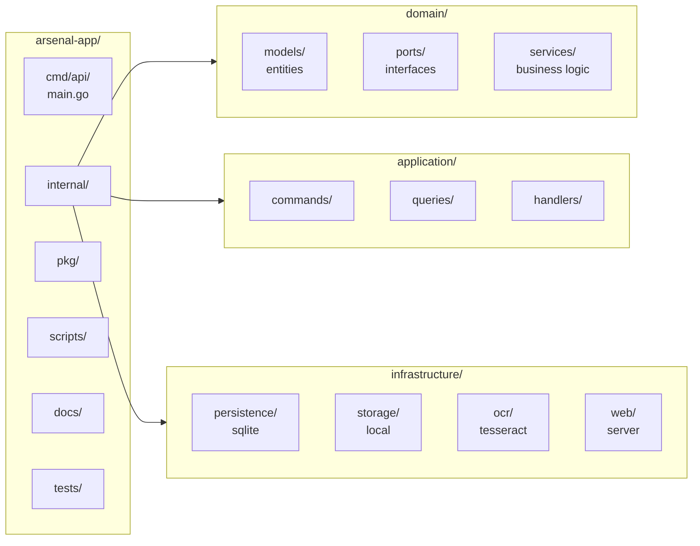
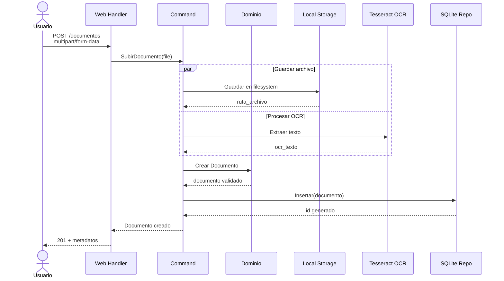
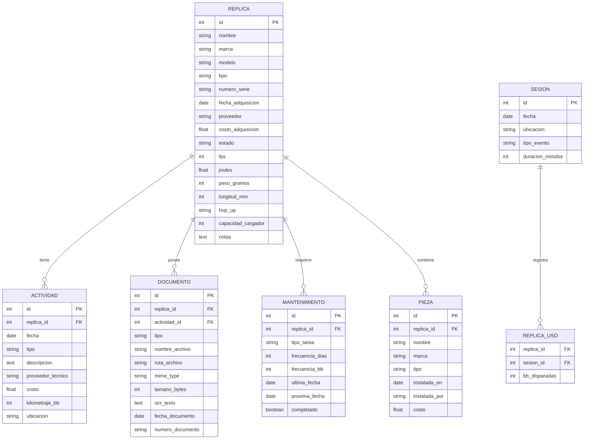

# Arsenal App - Arquitectura Hexagonal

App de gestión de réplicas airsoft - Inventario, mantenimiento, documentación DIAN y registro de uso.

## Desarrollo

- Rama principal: `development`
- Plan completo: [docs/PLAN.md](docs/PLAN.md)

## Stack

- Go 1.21+ (backend)
- SQLite (base de datos)
- HTMX + Alpine.js (frontend)
- Tailwind CSS (estilos)

## Estado

🚧 En fase de planificación y setup inicial.

---

## Diagrama de Arquitectura Hexagonal

## Estructura de Carpetas

## Flujo de Datos: Subida de Documento

## Modelo de Datos

---

*Repositorio privado - Digital Consultancy Solutions*