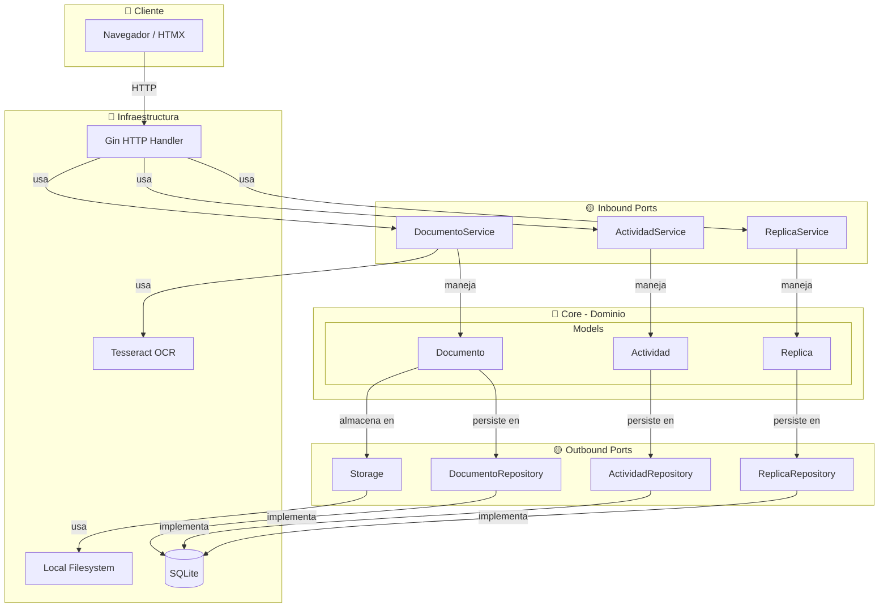

# Arsenal App - Plan de Desarrollo

## Visión

Aplicación web/móvil (PWA) para gestión integral de réplicas airsoft. Inventario personal, trazabilidad legal (DIAN), mantenimiento técnico, registro de uso y documentación.

## Stack Técnico Actual

| Capa | Tecnología | Justificación |
|------|-----------|---------------|
| **Backend** | Go 1.26+ | Performance, tipado fuerte, excelente para APIs |
| **Web Framework** | Gin | Ligero, middleware ecosystem maduro |
| **Base de Datos** | SQLite | Zero-config, portable, perfecto para single-user |
| **Migraciones** | golang-migrate | Estándar de la industria |
| **OCR** | gosseract (wrapper de Tesseract) | Extrae texto de documentos DIAN |
| **Storage** | fs (stdlib) + filepath | Filesystem local, simple |
| **Auth** | JWT (golang-jwt) | Stateless, perfecto para PWA |
| **Config** | Viper | .env, flags, defaults |
| **Testing** | testify | Unit + integration testing |
| **Frontend** | HTMX + Alpine.js | Minimal JS, server-rendered, PWA-capable |
| **Estilos** | Tailwind CSS | Utility-first, bundle pequeño |
| **Deploy** | Docker + Docker Compose | Portabilidad, reproducibilidad |
| **Network** | Tailscale | Acceso remoto seguro sin exponer puertos |

## Arquitectura

**Hexagonal (Ports & Adapters):**
- 🟥 **Dominio:** Entities + Ports (interfaces)
- 🟨 **Aplicación:** Services + Commands/Queries
- 🟦 **Infraestructura:** Repositories + Web + Storage + OCR

### Diagrama de Arquitectura



## Estructura del Proyecto

```
arsenal-app/
├── cmd/api/                      # Entry point (main.go)
├── internal/
│   ├── domain/                   # Núcleo hexagonal
│   │   ├── models/               # Entidades (Replica, Actividad, Documento)
│   │   ├── ports/
│   │   │   ├── inbound/        # Service interfaces
│   │   │   └── outbound/       # Repository interfaces
│   │   └── services/             # Lógica de negocio
│   ├── application/              # Casos de uso
│   │   ├── commands/             # Operaciones de escritura
│   │   ├── queries/              # Operaciones de lectura
│   │   └── handlers/             # Orquestadores
│   └── infrastructure/           # Adaptadores
│       ├── persistence/sqlite/   # Base de datos
│       ├── storage/local/        # Filesystem
│       ├── ocr/                  # Tesseract
│       └── web/                  # HTTP server (Gin)
├── pkg/                          # Librerías compartidas
├── scripts/                      # Utilidades
├── tests/                        # Tests
└── docs/                         # Documentación
    ├── PLAN.md                   # Este archivo
    ├── TASKS.md                  # Tareas por fase
    └── SECURITY.md               # Análisis de seguridad
```

## Estructura del Proyecto

```
arsenal-app/
├── app/                          # Next.js App Router
│   ├── (dashboard)/              # Layout principal
│   │   ├── replicas/             # Lista de réplicas
│   │   ├── replicas/[id]/        # Ficha de réplica
│   │   ├── mantenimiento/        # Calendario de mantenimiento
│   │   ├── documentos/           # Gestión documental
│   │   └── estadisticas/         # Dashboard de uso
│   ├── api/                      # API Routes
│   │   ├── trpc/                 # tRPC router
│   │   └── auth/                 # NextAuth handlers
│   └── layout.tsx                # Root layout
├── components/                   # Componentes React
│   ├── ui/                       # shadcn/ui base
│   ├── replica-card.tsx          # Tarjeta de réplica
│   ├── timeline.tsx              # Timeline de actividades
│   └── document-uploader.tsx     # Subida con OCR
├── lib/                          # Utilidades
│   ├── db/                       # Drizzle schema + queries
│   ├── auth.ts                   # Configuración auth
│   └── ocr.ts                    # Wrapper Tesseract.js
├── public/                       # Assets estáticos
│   └── uploads/                  # Archivos subidos (gitignored)
├── types/                        # Tipos TypeScript globales
├── docs/                         # Documentación del proyecto
│   ├── adr/                      # Architecture Decision Records
│   └── wireframes/               # Mockups y diseños
├── tests/                        # Tests E2E y unitarios
└── scripts/                      # Scripts de utilidad
    └── seed.ts                   # Datos de ejemplo
```

## Modelo de Datos (SQLite)

### Tablas Principales

```sql
-- Réplicas
CREATE TABLE replicas (
  id INTEGER PRIMARY KEY AUTOINCREMENT,
  nombre TEXT NOT NULL,              -- "HK416 A5"
  marca TEXT,                        -- "VFC", "Tokyo Marui", etc.
  modelo TEXT,                       -- Modelo específico del fabricante
  tipo TEXT,                         -- "AEG", "GBB", "HPA", "Spring"
  numero_serie TEXT UNIQUE,          -- Serial del fabricante
  fecha_adquisicion DATE,
  proveedor TEXT,
  costo_adquisicion REAL,
  estado TEXT DEFAULT 'activo',      -- activo, vendido, reparacion, prestado
  fps INTEGER,                       -- Feet per second
  joules REAL,                       -- Energía
  peso_gramos INTEGER,
  longitud_mm INTEGER,
  hop_up TEXT,                       -- Tipo de hop-up
  capacidad_cargador INTEGER,
  notas TEXT,
  created_at DATETIME DEFAULT CURRENT_TIMESTAMP,
  updated_at DATETIME DEFAULT CURRENT_TIMESTAMP
);

-- Actividades (registro de uso, mantenimiento, etc.)
CREATE TABLE actividades (
  id INTEGER PRIMARY KEY AUTOINCREMENT,
  replica_id INTEGER NOT NULL REFERENCES replicas(id),
  fecha DATE NOT NULL,
  tipo TEXT NOT NULL,                -- compra, venta, mantenimiento, reparacion, modificacion, uso, importacion, documentacion
  descripcion TEXT NOT NULL,
  proveedor_tecnico TEXT,            -- Quién hizo el trabajo
  costo REAL,
  kilometraje_bb INTEGER,            -- BBs disparadas en esta actividad (si aplica)
  ubicacion TEXT,                    -- Campo de juego, taller, etc.
  created_at DATETIME DEFAULT CURRENT_TIMESTAMP
);

-- Documentos (facturas, manuales, DIAN)
CREATE TABLE documentos (
  id INTEGER PRIMARY KEY AUTOINCREMENT,
  replica_id INTEGER REFERENCES replicas(id),
  actividad_id INTEGER REFERENCES actividades(id),
  tipo TEXT NOT NULL,                -- factura, manual, manifiesto_dian, declaracion_dian, foto, video, otro
  nombre_archivo TEXT NOT NULL,
  ruta_archivo TEXT NOT NULL,        -- Ruta relativa en public/uploads/
  mime_type TEXT,
  tamano_bytes INTEGER,
  ocr_texto TEXT,                    -- Texto extraído por OCR (si aplica)
  fecha_documento DATE,              -- Fecha que aparece en el documento
  numero_documento TEXT,             -- Número de factura, manifiesto, etc.
  notas TEXT,
  created_at DATETIME DEFAULT CURRENT_TIMESTAMP
);

-- Mantenimiento Programado
CREATE TABLE mantenimiento_programado (
  id INTEGER PRIMARY KEY AUTOINCREMENT,
  replica_id INTEGER NOT NULL REFERENCES replicas(id),
  tipo_tarea TEXT NOT NULL,          -- lubricacion, revision_compresion, cambio_orings, etc.
  frecuencia_dias INTEGER,           -- Cada cuántos días
  frecuencia_bb INTEGER,             -- O cada cuántas BBs
  ultima_fecha DATE,
  proxima_fecha DATE,
  completado BOOLEAN DEFAULT FALSE,
  notas TEXT
);

-- Piezas / Upgrades
CREATE TABLE piezas (
  id INTEGER PRIMARY KEY AUTOINCREMENT,
  replica_id INTEGER REFERENCES replicas(id),
  nombre TEXT NOT NULL,              -- "Piston SHS 14 teeth"
  marca TEXT,
  tipo TEXT,                         -- hop_up, piston, spring, barrel, motor, etc.
  instalada_en DATE,                 -- Cuándo se instaló
  instalada_por TEXT,                -- Quién la instaló
  costo REAL,
  notas TEXT,
  created_at DATETIME DEFAULT CURRENT_TIMESTAMP
);

-- Campos de Juego (log de uso)
CREATE TABLE sesiones_campo (
  id INTEGER PRIMARY KEY AUTOINCREMENT,
  fecha DATE NOT NULL,
  ubicacion TEXT,
  tipo_evento TEXT,                  -- practica, milsim, competencia
  duracion_minutos INTEGER,
  notas TEXT,
  created_at DATETIME DEFAULT CURRENT_TIMESTAMP
);

-- Relación réplicas-sesiones (qué réplicas se usaron)
CREATE TABLE replica_sesion (
  replica_id INTEGER REFERENCES replicas(id),
  sesion_id INTEGER REFERENCES sesiones_campo(id),
  bb_disparadas INTEGER,
  PRIMARY KEY (replica_id, sesion_id)
);
```

## Features por Fase

### Fase 1 - Foundation ✅ (Completada)
- [x] Setup proyecto Go + SQLite + migraciones
- [x] Arquitectura hexagonal (domain, application, infrastructure)
- [x] CRUD de réplicas (lista, crear, editar, ficha)
- [x] CRUD de actividades
- [x] Storage local para documentos
- [x] Tests de integración
- [x] Docker + Docker Compose

### Fase 2 - Seguridad + Core Ops ✅ (Completada)
- [x] Análisis de amenazas STRIDE
- [x] 11+ fixes de seguridad y operación aplicados
- [x] **Graceful shutdown** con signal.NotifyContext + serverErr channel
- [x] **Health check** con DB PingContext(2s) → 503 si DB caída
- [x] **Path traversal defense**: sanitize antes de filepath.Base, rechaza ../, abs paths, NUL
- [x] **Real upload cap**: http.MaxBytesReader(10MB) + 413 response (no solo memoria)
- [x] **Patrón run() error**: sin log.Fatalf, defer db.Close() siempre corre
- [x] SQLite busy_timeout=5000, SetMaxOpenConns(1) para WAL
- [x] Docker compose target: builder eliminado
- [x] CORS configurable via env
- [x] Tests de integración HTTP (health, CORS, 413, 400)

### Fase 3 - Gestión de Documentos ✅ (Completada)
- [x] Subida de archivos (multipart)
- [x] OCR con Tesseract
- [x] Búsqueda full-text por contenido OCR
- [ ] Timeline de actividades (pendiente de UI)

### Fase 4 - Frontend Web 🎨 (En Progreso)
- [ ] HTMX + Tailwind frontend
- [ ] Vistas: lista de réplicas, detalle, formularios
- [ ] Dashboard con estadísticas
- [ ] PWA manifest + service worker

### Fase 5 - Autenticación y Seguridad API
- [ ] JWT Authentication
- [ ] Rate limiting
- [ ] Audit logging

### Fase 6 - Mantenimiento + DIAN
- [ ] Calendario de mantenimiento
- [ ] Recordatorios (cron jobs locales)
- [ ] Campos específicos importación DIAN
- [ ] Búsqueda por número manifiesto/serial

### Fase 7 - Polish + Deploy
- [ ] Backup automático
- [ ] Export JSON/CSV
- [ ] PM2 config
- [ ] Documentación deploy Mac mini
- [ ] README completo
- [ ] GitHub Actions CI/CD
- [ ] Release v1.0.0

## Wireframes / UI Ideas

### Dashboard Principal
```
+--------------------------------------------------+
|  Arsenal App                        [+] Nueva    |
+--------------------------------------------------+
|                                                   |
|  MIS RÉPLICAS          PRÓXIMO MANTENIMIENTO      |
  +--------+--------+    +------------------------+ |
  | [foto] | [foto] |    | HK416 A5               | |
  | HK416  | M4A1   |    | Lubricación en 5 días  | |
  |   A5   |        |    +------------------------+ |
  +--------+--------+                               |
|                                                   |
|  ACTIVIDAD RECIENTE                               |
|  • 2026-05-23 - Compra HK416 A5 (Universal)      |
|  • 2026-05-24 - Desempaque + documentación       |
|                                                   |
+--------------------------------------------------+
```

### Ficha de Réplica
```
+--------------------------------------------------+
|  < HK416 A5                          [Editar]    |
+--------------------------------------------------+
|  [Foto principal]        Estado: Activo           |
|                          FPS: 380                 |
|  Serial: ABC123456       Joules: 1.2              |
|                                                   |
  [Timeline] [Docs] [Mant.] [Stats]                |
+--------------------------------------------------+
|  2026-05-23  ● Compra                             |
|              Universal de deportes SAS            |
|              [📄 Factura]                          |
|                                                   |
|  2026-05-24  ● Documentación                      |
|              Desempaque + fotos DIAN               |
|              [📷] [🎥]                            |
+--------------------------------------------------+
```

## Decisiones de Arquitectura (ADRs)

### ADR-001: Arquitectura Hexagonal sobre MVC
**Contexto:** Necesitamos testabilidad, independencia de frameworks, y claridad de dependencias.
**Decisión:** Arquitectura Hexagonal (Ports & Adapters). Dominio puro en el centro, infraestructura desacoplable.
**Consecuencias:** Más archivos/boilerplate inicial, pero máxima flexibilidad para cambiar DB, web framework, o storage.

### ADR-002: Go sobre Python/Node.js
**Contexto:** App personal, un solo dev, prioridad en performance y type safety.
**Decisión:** Go por compilación a binario único, deployment trivial, y excelente tooling.
**Consecuencias:** Menos ecosystem frontend (usamos HTMX), más verbose que Python, pero más robusto.

### ADR-003: SQLite sobre PostgreSQL
**Contexto:** Single-user app, Mac mini server, zero-config deseado.
**Decisión:** SQLite con WAL mode. Backup es copiar archivo.
**Consecuencias:** No escala a multi-user concurrente. Para multi-user futuro, migrar a PostgreSQL.

### ADR-004: HTMX + Alpine.js sobre React/Vue
**Contexto:** Queremos PWA con mínimo JavaScript, server-rendered, y sin build step complejo.
**Decisión:** HTMX para interacciones AJAX, Alpine.js para reactividad ligera.
**Consecuencias:** Menos "app-like", más "web-like". Bundle pequeño, SEO-friendly.

### ADR-005: Filesystem Local sobre Cloud Storage
**Contexto:** Privacidad de documentos DIAN, costo cero, control total.
**Decisión:** ~/arsenal-uploads/ con estructura por réplica.
**Consecuencias:** Backup manual (rsync a GitHub/otro repo). Sin CDN.

### ADR-006: Docker sobre PM2 directo
**Contexto:** Necesitamos reproducibilidad y portabilidad del deploy.
**Decisión:** Docker + Docker Compose para desarrollo y producción.
**Consecuencias:** Overhead mínimo, pero máxima consistencia entre ambientes.

## Roadmap Extendido (Post-MVP)

- [ ] **Multi-usuario:** Auth real, roles (propietario, técnico, visualizador)
- [ ] **Marketplace interno:** Registro de ventas entre usuarios
- [ ] **Integración campos:** Lista de campos de juego en Colombia con reviews
- [ ] **Comunidad:** Compartir specs anónimamente para base de datos colaborativa
- [ ] **Importación desde GitHub:** Migrar datos del repo personal actual
- [ ] **Backup automático:** Sync a GitHub/GitLab como backup de documentos
- [ ] **App móvil nativa:** Expo/React Native si PWA no alcanza

## Notas de Desarrollo

- Usar `sharp` para optimización de imágenes al subir
- Videos: almacenar como están, mostrar con `<video>` tag
- OCR: procesar en cliente para no cargar servidor, guardar resultado en DB
- Tailscale para acceso remoto seguro desde cualquier lugar
- PM2 para mantener el proceso vivo en Mac mini

---

*Documento vivo - se actualiza conforme avanza el desarrollo*
