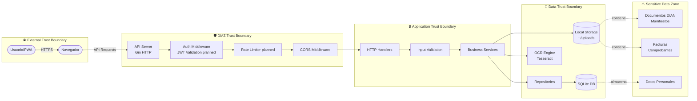
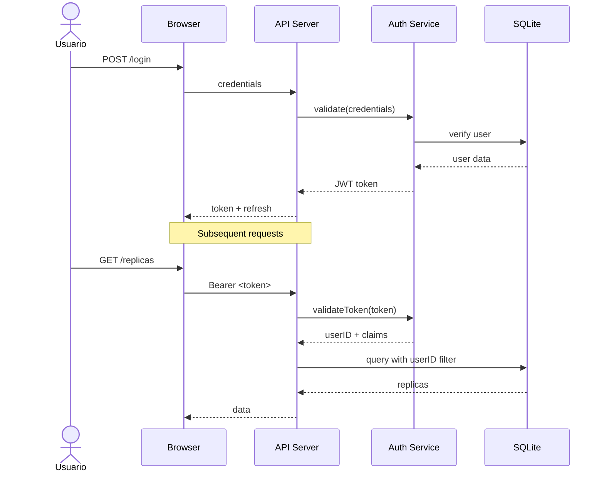
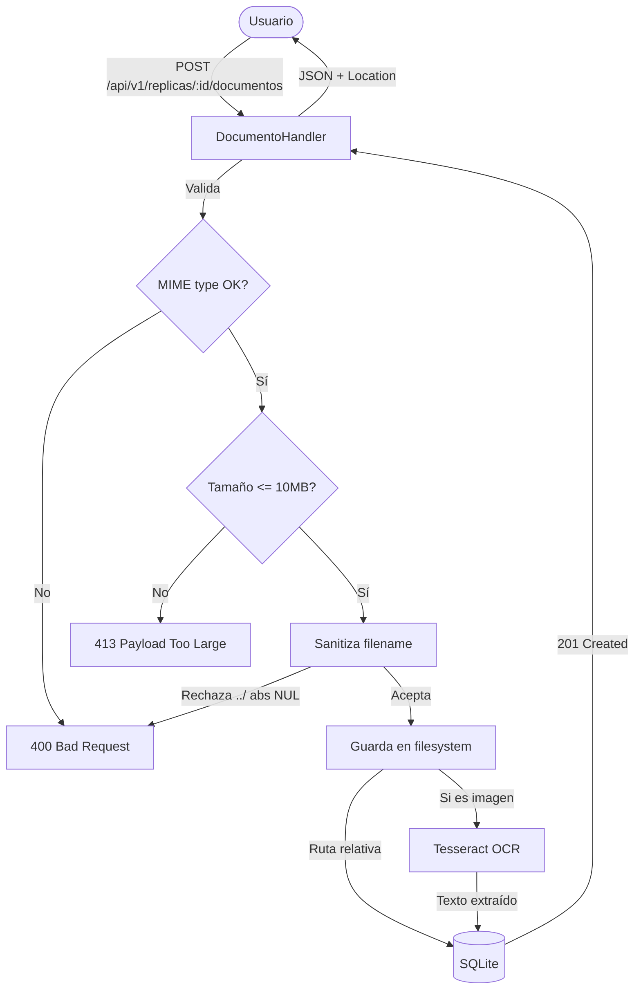
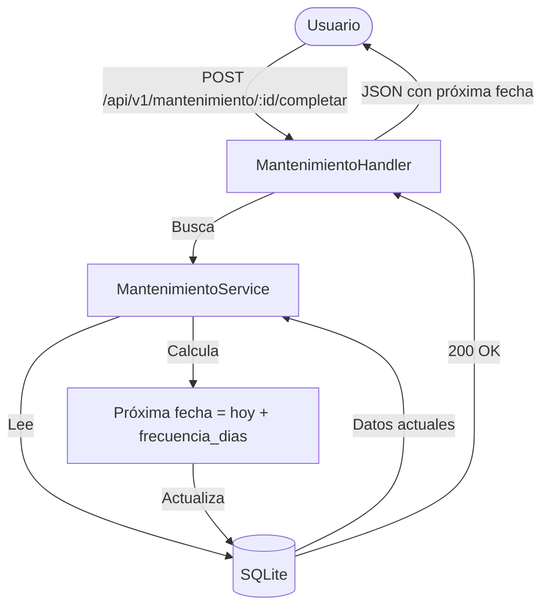
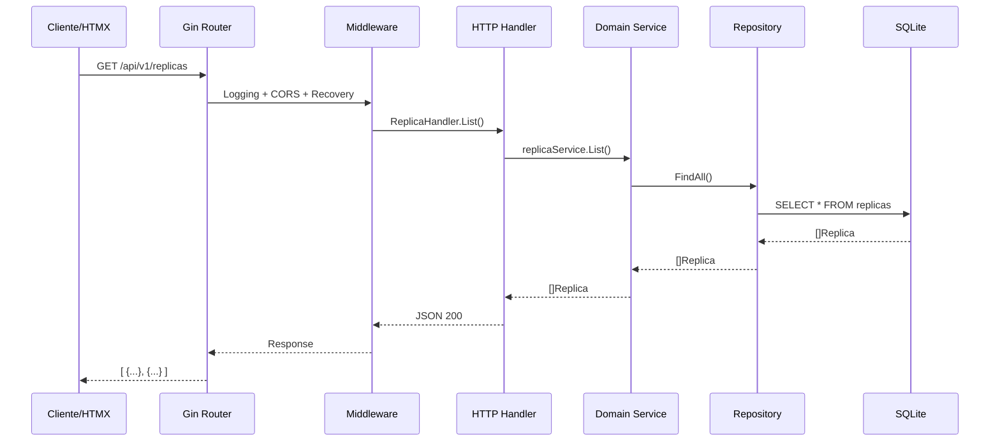
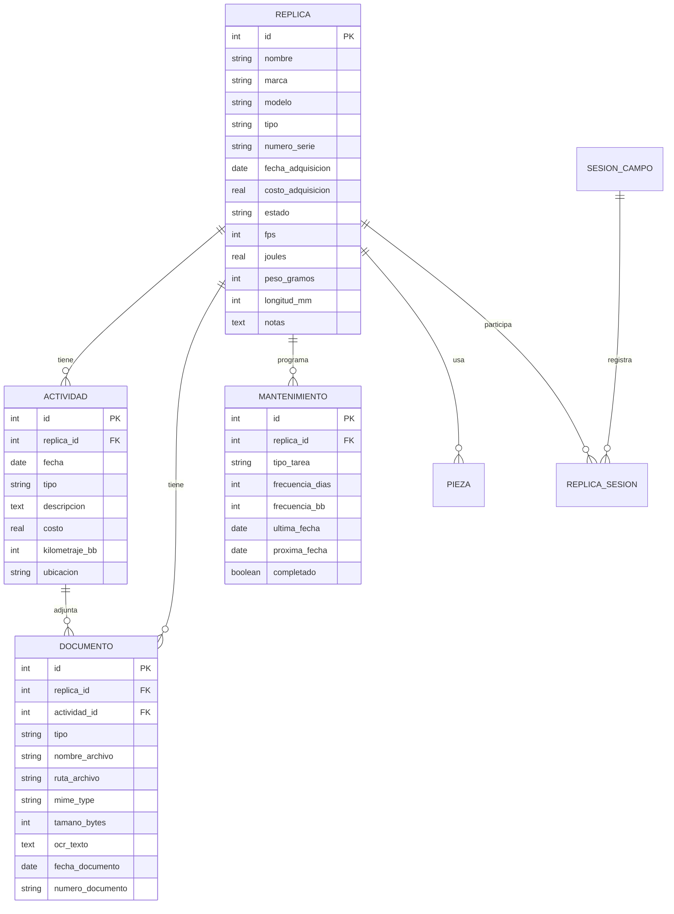

# Arsenal App - Análisis de Seguridad (Threat Model)

## 1. Diagrama de Flujo de Datos (DFD) con Trust Boundaries



## 2. Identificación de Activos

| Activo | Tipo | Sensibilidad | Ubicación |
|--------|------|-------------|-----------|
| Documentos DIAN (manifiestos) | Legal/Importación | 🔴 Alta | Local Storage |
| Facturas de compra | Financiera | 🟠 Media-Alta | Local Storage |
| Datos de réplicas (seriales) | Identificación | 🟡 Media | SQLite |
| Registro de actividades | Operativa | 🟢 Baja | SQLite |
| Fotos/videos | Personal | 🟡 Media | Local Storage |
| Credenciales JWT | Auth planeado | 🔴 Alta | Memoria |

## 3. Vectores de Amenaza (STRIDE)

### S - Spoofing (Suplantación)
- **Amenaza:** Acceso no autorizado a la API
- **Vector:** Robo de token JWT, session hijacking
- **Impacto:** 🔴 Crítico - Acceso a documentos DIAN
- **Mitigación:**
  - [ ] JWT con expiración corta (15 min)
  - [ ] Refresh tokens rotativos
  - [ ] HTTPS obligatorio
  - [ ] IP binding opcional

### T - Tampering (Manipulación)
- **Amenaza:** Modificación de documentos o registros
- **Vector:** Acceso directo a filesystem o DB
- **Impacto:** 🟠 Alto - Evidencia legal alterada
- **Mitigación:**
  - [ ] Hash SHA-256 de documentos en DB
  - [ ] Audit log inmutable
  - [ ] File permissions restrictivos (600)
  - [ ] WAL mode SQLite para integridad

### R - Repudiation (Repudio)
- **Amenaza:** Negación de acciones realizadas
- **Vector:** Usuario niega haber creado/borrado algo
- **Impacto:** 🟡 Medio - Problemas legales
- **Mitigación:**
  - [ ] Audit logging completo (quién, qué, cuándo)
  - [ ] Timestamps inmutables
  - [ ] Backup automático de logs

### I - Information Disclosure (Divulgación)
- **Amenaza:** Fuga de documentos sensibles
- **Vector:** 
  - Directory traversal en uploads
  - Backup expuesto
  - Logs con datos sensibles
- **Impacto:** 🔴 Crítico - Documentos DIAN expuestos
- **Mitigación:**
  - [ ] Path sanitization estricta
  - [ ] No servir archivos directamente, usar proxy
  - [ ] Logs sin contenido de documentos
  - [ ] Encriptación de uploads opcional
  - [ ] .gitignore para data/ y uploads/

### D - Denial of Service (Negación de Servicio)
- **Amenaza:** App no disponible
- **Vector:**
  - Subida masiva de archivos grandes
  - OCR excesivo consume CPU
  - DB locked por operaciones largas
  - Crash del servidor sin graceful shutdown
- **Impacto:** 🟡 Medio - Inconveniente
- **Mitigación:**
  - [ ] Rate limiting (100 req/min)
  - [x] **Max file size (10MB)**: `http.MaxBytesReader` corta el body en el límite real; 413 si se excede
  - [ ] Timeout en OCR (30s)
  - [x] **Connection pooling SQLite**: `SetMaxOpenConns(1)` + `_busy_timeout=5000` para WAL
  - [x] **Health checks**: `/health` con `PingContext(2s)` → 503 si DB caída, facilita auto-restart
  - [x] **Graceful shutdown**: `signal.NotifyContext` + `serverErr` channel + `Shutdown(10s)` garantiza cierre limpio y ejecución de defers (`db.Close`)

### E - Elevation of Privilege (Escalación)
- **Amenaza:** Acceso a datos de otros usuarios (futuro multi-user)
- **Vector:** IDOR (Insecure Direct Object Reference)
- **Impacto:** 🟠 Alto - Datos cruzados
- **Mitigación:**
  - [ ] User ID en JWT claims
  - [ ] Validar ownership en cada query
  - [ ] No confiar en IDs del cliente sin validar

## 4. Controles de Seguridad Implementados

### ✅ Ya implementados (Fase 1-2)
- [x] SQLite con foreign keys y constraints
- [x] Soft delete (no borrado físico)
- [x] CORS middleware (configurable via env)
- [x] Input validation básica en servicios
- [x] .gitignore para data/ y uploads/
- [x] **Path traversal protection**: sanitizeFilename rechaza `../`, paths absolutos, NUL, separadores ANTES de `filepath.Base`; validación con `filepath.Rel`
- [x] **Real upload size cap**: `http.MaxBytesReader(10MB)` + `ParseMultipartForm`; response 413 (no 400) al exceder límite
- [x] **Graceful shutdown**: `signal.NotifyContext` + `serverErr` channel + `http.Server.Shutdown` con timeout 10s
- [x] **Patrón run() error**: sin `log.Fatalf`, todos los errores retornan `fmt.Errorf` con `%w`; `defer db.Close()` garantizado en todos los paths
- [x] **Health check**: `PingContext(2s)` → HTTP 503 si DB no responde
- [x] **SQLite hardening**: `_busy_timeout=5000`, `SetMaxOpenConns(1)` para WAL mode, skip `MkdirAll` en `:memory:`
- [x] **Tests de integración**: HTTP handler tests (health 200/503, CORS allow/block/preflight, upload 413)

### 🔄 Pendientes Fase 6
- [ ] JWT Authentication
- [ ] Rate limiting
- [ ] Audit logging
- [ ] File hash verification
- [ ] OCR timeout controls

### 📋 Futuros (Fase 7+)
- [ ] Encriptación de documentos sensibles
- [ ] Backup automático encriptado
- [ ] 2FA opcional
- [ ] Session management
- [ ] Security headers (HSTS, CSP, X-Frame-Options)

## 5. Diagrama de Secuencia: Autenticación Segura



## 6. Recomendaciones de Seguridad para Deploy

### Docker Security
```dockerfile
# Usar non-root user
RUN adduser -D -u 1000 arsenal
USER arsenal

# Read-only filesystem donde sea posible
# No exponer puertos innecesarios
# Health checks para detectar compromises
```

### Filesystem Permissions
```bash
# Directorio de uploads
chmod 700 ~/arsenal-uploads
chown $(whoami):$(whoami) ~/arsenal-uploads

# Base de datos
chmod 600 ~/arsenal-data/arsenal.db

# Logs (solo append)
chmod 644 ~/arsenal-data/audit.log
```

### Network Security
- [ ] Tailscale para acceso remoto (no exponer puertos públicos)
- [ ] Firewall: solo localhost + Tailscale IP
- [ ] No exponer 8080 directamente a internet

## 7. Incident Response Plan

### Si hay fuga de documentos:
1. Identificar qué documentos fueron expuestos
2. Rotar JWT secrets inmediatamente
3. Revisar logs de acceso
4. Notificar a autoridades si aplica (DIAN)
5. Backup forense antes de tocar nada

### Si hay acceso no autorizado:
1. Revocar todos los tokens activos
2. Forzar re-login
3. Revisar audit log de las últimas 24h
4. Cambiar credenciales de sistema

## Diagramas de Flujo de Procesos

### Flujo: Subida de Documento



### Flujo: Mantenimiento Programado



### Flujo: Health Check

```mermaid
flowchart TD
    Client([Monitor/Load Balancer]) -->|GET /health| Handler[HealthHandler]
    Handler -->|PingContext(2s)| DB[(SQLite)]
    DB -->|OK| Handler
    Handler -->|200 + status: healthy| Client
    DB -.->|Timeout/Error| Handler
    Handler -->|503 + status: unhealthy| Client
```

## Diagrama de Secuencia: Request Completo



## Diagrama ER (Entidad-Relación)



---

*Documento vivo - actualizar con cada fase*
