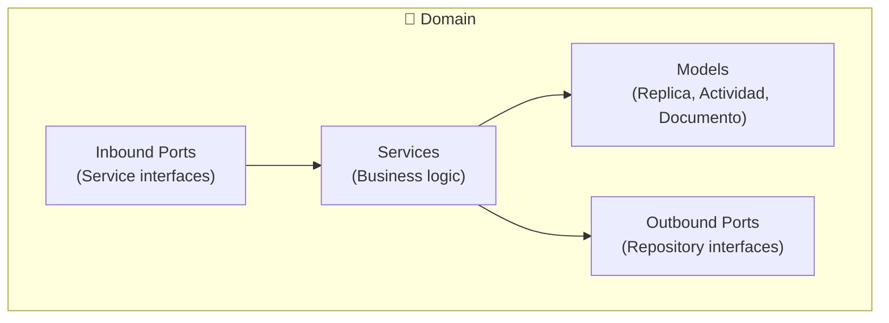

# internal/domain

## ¿Qué es?

Núcleo de la arquitectura hexagonal. Contiene las entidades de negocio, los puertos (interfaces), y la lógica pura que no depende de frameworks ni infraestructura.

## Subcarpetas

| Carpeta | Contenido |
|---------|-----------|
| `models/` | Entidades: `Replica`, `Actividad`, `Documento`, `Mantenimiento` |
| `ports/inbound/` | Interfaces de servicio (qué puede hacer la app) |
| `ports/outbound/` | Interfaces de repositorio (qué necesita la app del exterior) |
| `services/` | Implementación de la lógica de negocio |

## Principio

> "El dominio no sabe nada de HTTP, SQL, ni filesystem. Solo define contratos."

## Diagrama

