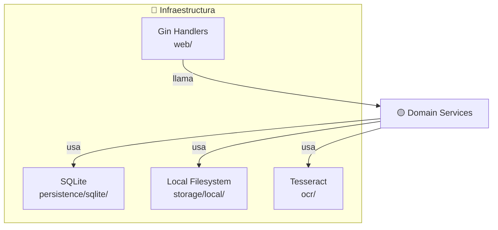

# internal/infrastructure

## ¿Qué es?

Adaptadores de la arquitectura hexagonal. Implementan los puertos outbound definidos en `internal/domain/ports/outbound/`. Son los únicos que interactúan con tecnologías externas.

## Subcarpetas

| Carpeta | Tecnología | Responsabilidad |
|---------|-----------|----------------|
| `persistence/sqlite/` | SQLite | Implementa `ReplicaRepository`, `ActividadRepository`, `DocumentoRepository` |
| `storage/local/` | Filesystem | Implementa `Storage` — guarda/lee archivos en `~/arsenal-uploads/` |
| `ocr/` | Tesseract CLI | Implementa `OCRService` — extrae texto de imágenes |
| `web/` | Gin HTTP | Handlers HTTP, routing, middleware |

## Seguridad implementada

- **Path traversal defense**: `sanitizeFilename` rechaza `../`, paths absolutos, NUL
- **Max upload size**: `http.MaxBytesReader(10MB)` con response 413
- **SQLite hardening**: `_busy_timeout=5000`, `SetMaxOpenConns(1)`
- **Graceful shutdown**: `signal.NotifyContext` + `server.Shutdown(10s)`

## Diagrama

